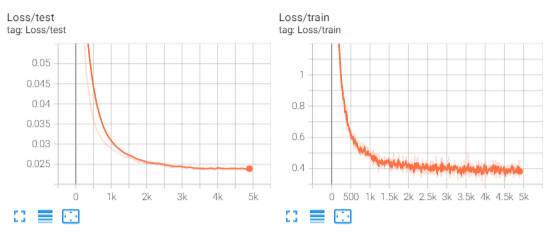
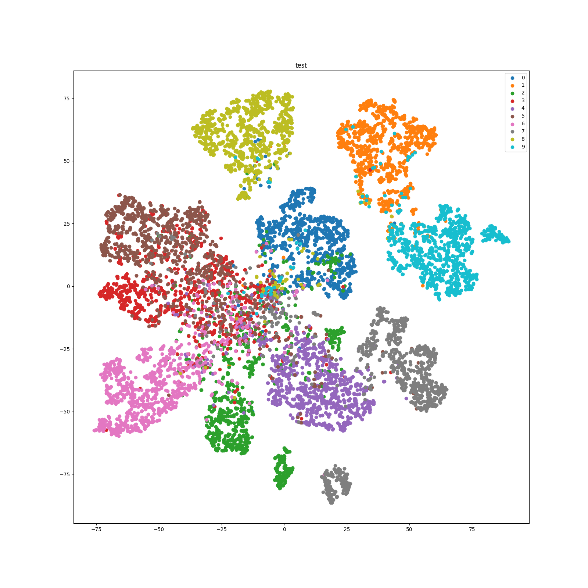

# Overview

Here is an example of applying PreAct-ResNet18 to train SimCLR on CIFAR10. 
We use 1x RTX 3090 in this example. 
The training process consists of two phases: (1) self-supervised training; and (2) linear evaluation.

# How to run
The training commands are specified in:  
```shell
bash train.sh
```  

Besides linear evaluation, you can also visualize the learned representations by (remember modifying 'log_name' and 'epoch' in advance):  
'''python 
python visualization.py
'''

# Results
The loss curve of SimCLR self-supervised training is as follows:  

The loss curve of linear evaluation is as follows:  

The accuracy curve of linear evaluation is as follows:  

The t-SNE of the training set of CIFAR10 is as follows:  

The t-SNE of the test set of CIFAR10 is as follows:  
